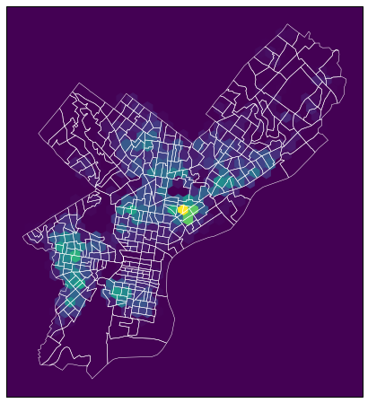

# Exploring Evictions and Code Violations in Philadelphia

Third Assignment of MUSA 620 Data Wrangling and Data Visualization of University of Pennsylvania.


We'll explore spatial trends evictions in Philadelphia using data from the [Eviction Lab](https://evictionlab.org/) and building code violations using data from [OpenDataPhilly](https://www.opendataphilly.org/).

And we'll be exploring the idea that evictions can occur as retaliation against renters for reporting code violations. Spatial correlations between evictions and code violations from the City's Licenses and Inspections department can offer some insight into this question. 

## 1. Explore Eviction Lab Data


### 1.1 Read data using `geopandas`

The first step is to read the eviction data by census tract using `geopandas`. The data for all of Pennsylvania by census tract is downloaded in a GeoJSON format using the following url:

https://eviction-lab-data-downloads.s3.amazonaws.com/PA/tracts.geojson


```python
import pandas as pd
import geopandas as gpd
import hvplot.pandas
import cartopy.crs as ccrs
from pyrestcli.auth import NoAuthClient
from carto.sql import SQLClient
from matplotlib import pyplot as plt

%matplotlib inline
```


<link rel="stylesheet" href="https://code.jquery.com/ui/1.10.4/themes/smoothness/jquery-ui.css">
<style>div.bk-hbox {
    display: flex;
    justify-content: center;
}

div.bk-hbox div.bk-plot {
    padding: 8px;
}

div.bk-hbox div.bk-data-table {
    padding: 20px;
}

div.hololayout {
  display: flex;
  align-items: center;
  margin: 0;
}

div.holoframe {
  width: 75%;
}

div.holowell {
  display: flex;
  align-items: center;
}

form.holoform {
  background-color: #fafafa;
  border-radius: 5px;
  overflow: hidden;
  padding-left: 0.8em;
  padding-right: 0.8em;
  padding-top: 0.4em;
  padding-bottom: 0.4em;
  box-shadow: inset 0 1px 1px rgba(0, 0, 0, 0.05);
  margin-bottom: 20px;
  border: 1px solid #e3e3e3;
}

div.holowidgets {
  padding-right: 0;
  width: 25%;
}

div.holoslider {
  min-height: 0 !important;
  height: 0.8em;
  width: 100%;
}

div.holoformgroup {
  padding-top: 0.5em;
  margin-bottom: 0.5em;
}

div.hologroup {
  padding-left: 0;
  padding-right: 0.8em;
  width: 100%;
}

.holoselect {
  width: 92%;
  margin-left: 0;
  margin-right: 0;
}

.holotext {
  padding-left:  0.5em;
  padding-right: 0;
  width: 100%;
}

.holowidgets .ui-resizable-se {
  visibility: hidden
}

.holoframe > .ui-resizable-se {
  visibility: hidden
}

.holowidgets .ui-resizable-s {
  visibility: hidden
}


/* CSS rules for noUISlider based slider used by JupyterLab extension  */

.noUi-handle {
  width: 20px !important;
  height: 20px !important;
  left: -5px !important;
  top: -5px !important;
}

.noUi-handle:before, .noUi-handle:after {
  visibility: hidden;
  height: 0px;
}

.noUi-target {
  margin-left: 0.5em;
  margin-right: 0.5em;
}
</style>


```python
url = 'https://eviction-lab-data-downloads.s3.amazonaws.com/PA/tracts.geojson'
df = gpd.read_file(url, crs={'init': 'epsg:4326'})
```


```python
df.head(3)
```


<div>
<style scoped>
    .dataframe tbody tr th:only-of-type {
        vertical-align: middle;
    }

    .dataframe tbody tr th {
        vertical-align: top;
    }

    .dataframe thead th {
        text-align: right;
    }
</style>
<table border="1" class="dataframe">
  <thead>
    <tr style="text-align: right;">
      <th></th>
      <th>GEOID</th>
      <th>west</th>
      <th>south</th>
      <th>east</th>
      <th>north</th>
      <th>n</th>
      <th>pl</th>
      <th>p-00</th>
      <th>pr-00</th>
      <th>roh-00</th>
      <th>...</th>
      <th>pm-16</th>
      <th>po-16</th>
      <th>ef-16</th>
      <th>e-16</th>
      <th>er-16</th>
      <th>efr-16</th>
      <th>lf-16</th>
      <th>imputed-16</th>
      <th>subbed-16</th>
      <th>geometry</th>
    </tr>
  </thead>
  <tbody>
    <tr>
      <th>0</th>
      <td>42003412002</td>
      <td>-80.1243</td>
      <td>40.5422</td>
      <td>-80.0640</td>
      <td>40.5890</td>
      <td>4120.02</td>
      <td>Allegheny County, Pennsylvania</td>
      <td>4748.59</td>
      <td>0.88</td>
      <td>58.0</td>
      <td>...</td>
      <td>0.00</td>
      <td>0.0</td>
      <td>0.0</td>
      <td>0.0</td>
      <td>0.00</td>
      <td>0.00</td>
      <td>1.0</td>
      <td>0.0</td>
      <td>1.0</td>
      <td>(POLYGON ((-80.06670099999999 40.584012, -80.0...</td>
    </tr>
    <tr>
      <th>1</th>
      <td>42003413100</td>
      <td>-80.0681</td>
      <td>40.5850</td>
      <td>-79.9906</td>
      <td>40.6143</td>
      <td>4131</td>
      <td>Allegheny County, Pennsylvania</td>
      <td>6771.01</td>
      <td>3.47</td>
      <td>729.0</td>
      <td>...</td>
      <td>1.59</td>
      <td>0.0</td>
      <td>12.0</td>
      <td>2.0</td>
      <td>0.27</td>
      <td>1.62</td>
      <td>1.0</td>
      <td>0.0</td>
      <td>1.0</td>
      <td>(POLYGON ((-80.068057 40.612536, -80.054520999...</td>
    </tr>
    <tr>
      <th>2</th>
      <td>42003413300</td>
      <td>-80.0657</td>
      <td>40.5527</td>
      <td>-80.0210</td>
      <td>40.5721</td>
      <td>4133</td>
      <td>Allegheny County, Pennsylvania</td>
      <td>5044.59</td>
      <td>2.99</td>
      <td>119.0</td>
      <td>...</td>
      <td>0.95</td>
      <td>0.0</td>
      <td>4.0</td>
      <td>1.0</td>
      <td>0.49</td>
      <td>1.96</td>
      <td>1.0</td>
      <td>0.0</td>
      <td>1.0</td>
      <td>(POLYGON ((-80.03821600000001 40.553495, -80.0...</td>
    </tr>
  </tbody>
</table>
<p>3 rows × 399 columns</p>
</div>


### 1.2 Explore and trim the data 

We will need to trim data to Philadelphia only


```python
phila = df[df['pl'] == 'Philadelphia County, Pennsylvania'].reset_index(drop = True)
```


```python
phila.head(3)
```


<div>
<style scoped>
    .dataframe tbody tr th:only-of-type {
        vertical-align: middle;
    }

    .dataframe tbody tr th {
        vertical-align: top;
    }

    .dataframe thead th {
        text-align: right;
    }
</style>
<table border="1" class="dataframe">
  <thead>
    <tr style="text-align: right;">
      <th></th>
      <th>GEOID</th>
      <th>west</th>
      <th>south</th>
      <th>east</th>
      <th>north</th>
      <th>n</th>
      <th>pl</th>
      <th>p-00</th>
      <th>pr-00</th>
      <th>roh-00</th>
      <th>...</th>
      <th>pm-16</th>
      <th>po-16</th>
      <th>ef-16</th>
      <th>e-16</th>
      <th>er-16</th>
      <th>efr-16</th>
      <th>lf-16</th>
      <th>imputed-16</th>
      <th>subbed-16</th>
      <th>geometry</th>
    </tr>
  </thead>
  <tbody>
    <tr>
      <th>0</th>
      <td>42101000100</td>
      <td>-75.1523</td>
      <td>39.9481</td>
      <td>-75.1415</td>
      <td>39.9569</td>
      <td>1</td>
      <td>Philadelphia County, Pennsylvania</td>
      <td>2646.71</td>
      <td>9.26</td>
      <td>1347.0</td>
      <td>...</td>
      <td>2.49</td>
      <td>0.0</td>
      <td>25.0</td>
      <td>16.0</td>
      <td>0.93</td>
      <td>1.45</td>
      <td>0.0</td>
      <td>0.0</td>
      <td>1.0</td>
      <td>(POLYGON ((-75.14160699999999 39.955491, -75.1...</td>
    </tr>
    <tr>
      <th>1</th>
      <td>42101000200</td>
      <td>-75.1631</td>
      <td>39.9529</td>
      <td>-75.1511</td>
      <td>39.9578</td>
      <td>2</td>
      <td>Philadelphia County, Pennsylvania</td>
      <td>1362.00</td>
      <td>56.42</td>
      <td>374.0</td>
      <td>...</td>
      <td>2.27</td>
      <td>0.0</td>
      <td>11.0</td>
      <td>8.0</td>
      <td>0.95</td>
      <td>1.30</td>
      <td>0.0</td>
      <td>0.0</td>
      <td>1.0</td>
      <td>(POLYGON ((-75.151223 39.956862, -75.151669 39...</td>
    </tr>
    <tr>
      <th>2</th>
      <td>42101000300</td>
      <td>-75.1798</td>
      <td>39.9544</td>
      <td>-75.1623</td>
      <td>39.9599</td>
      <td>3</td>
      <td>Philadelphia County, Pennsylvania</td>
      <td>2570.00</td>
      <td>12.16</td>
      <td>861.0</td>
      <td>...</td>
      <td>1.76</td>
      <td>0.0</td>
      <td>26.0</td>
      <td>14.0</td>
      <td>0.73</td>
      <td>1.35</td>
      <td>0.0</td>
      <td>0.0</td>
      <td>1.0</td>
      <td>(POLYGON ((-75.162339 39.957825, -75.162374 39...</td>
    </tr>
  </tbody>
</table>
<p>3 rows × 399 columns</p>
</div>


### 1.3 Transform from wide to tidy format


```python
phila_tidy = pd.melt(phila, id_vars = ['GEOID', 'geometry'], 
                     value_vars = ['e-{:02d}'.format(x) for x in range(3, 17)],
                    var_name = 'eviction_year', value_name = 'count')
```


```python
phila_tidy.head()
```


<div>
<style scoped>
    .dataframe tbody tr th:only-of-type {
        vertical-align: middle;
    }

    .dataframe tbody tr th {
        vertical-align: top;
    }

    .dataframe thead th {
        text-align: right;
    }
</style>
<table border="1" class="dataframe">
  <thead>
    <tr style="text-align: right;">
      <th></th>
      <th>GEOID</th>
      <th>geometry</th>
      <th>eviction_year</th>
      <th>count</th>
    </tr>
  </thead>
  <tbody>
    <tr>
      <th>0</th>
      <td>42101000100</td>
      <td>(POLYGON ((-75.14160699999999 39.955491, -75.1...</td>
      <td>e-03</td>
      <td>21.0</td>
    </tr>
    <tr>
      <th>1</th>
      <td>42101000200</td>
      <td>(POLYGON ((-75.151223 39.956862, -75.151669 39...</td>
      <td>e-03</td>
      <td>3.0</td>
    </tr>
    <tr>
      <th>2</th>
      <td>42101000300</td>
      <td>(POLYGON ((-75.162339 39.957825, -75.162374 39...</td>
      <td>e-03</td>
      <td>17.0</td>
    </tr>
    <tr>
      <th>3</th>
      <td>42101000801</td>
      <td>(POLYGON ((-75.177323 39.950964, -75.177843 39...</td>
      <td>e-03</td>
      <td>13.0</td>
    </tr>
    <tr>
      <th>4</th>
      <td>42101000804</td>
      <td>(POLYGON ((-75.17118000000001 39.947784, -75.1...</td>
      <td>e-03</td>
      <td>21.0</td>
    </tr>
  </tbody>
</table>
</div>


### 1.4 Plot the total number of evictions per year from 2003 to 2016


```python
phila_tidy['year'] = phila_tidy['eviction_year'].apply(lambda x : '20' + x[2:])
```


```python
by_year = phila_tidy.groupby('year')['count'].sum().reset_index()
```


```python
by_year
```


<div>
<style scoped>
    .dataframe tbody tr th:only-of-type {
        vertical-align: middle;
    }

    .dataframe tbody tr th {
        vertical-align: top;
    }

    .dataframe thead th {
        text-align: right;
    }
</style>
<table border="1" class="dataframe">
  <thead>
    <tr style="text-align: right;">
      <th></th>
      <th>year</th>
      <th>count</th>
    </tr>
  </thead>
  <tbody>
    <tr>
      <th>0</th>
      <td>2003</td>
      <td>10647.0</td>
    </tr>
    <tr>
      <th>1</th>
      <td>2004</td>
      <td>10491.0</td>
    </tr>
    <tr>
      <th>2</th>
      <td>2005</td>
      <td>10550.0</td>
    </tr>
    <tr>
      <th>3</th>
      <td>2006</td>
      <td>11078.0</td>
    </tr>
    <tr>
      <th>4</th>
      <td>2007</td>
      <td>11032.0</td>
    </tr>
    <tr>
      <th>5</th>
      <td>2008</td>
      <td>10866.0</td>
    </tr>
    <tr>
      <th>6</th>
      <td>2009</td>
      <td>9821.0</td>
    </tr>
    <tr>
      <th>7</th>
      <td>2010</td>
      <td>10628.0</td>
    </tr>
    <tr>
      <th>8</th>
      <td>2011</td>
      <td>10882.0</td>
    </tr>
    <tr>
      <th>9</th>
      <td>2012</td>
      <td>11130.0</td>
    </tr>
    <tr>
      <th>10</th>
      <td>2013</td>
      <td>10803.0</td>
    </tr>
    <tr>
      <th>11</th>
      <td>2014</td>
      <td>11182.0</td>
    </tr>
    <tr>
      <th>12</th>
      <td>2015</td>
      <td>10098.0</td>
    </tr>
    <tr>
      <th>13</th>
      <td>2016</td>
      <td>10264.0</td>
    </tr>
  </tbody>
</table>
</div>


```python
by_year.hvplot(x = 'year', y = 'count', kind = 'line')
```


<div id='1005' style='display: table; margin: 0 auto;'>


  <div class="bk-root" id="f784e74c-75a3-406f-b734-ec14b9f3b618" data-root-id="1005"></div>
</div>


### 1.5 The number of evictions across Philadelphia


```python
phila_tidy = gpd.GeoDataFrame(phila_tidy, geometry='geometry', 
                            crs={'init':'epsg:4326'})
```


```python
phila_tidy = phila_tidy.to_crs(epsg=3857)
```


```python
phila_tidy.crs
```


    {'init': 'epsg:3857', 'no_defs': True}


```python
phila_tidy.hvplot(c='count', crs = 3857, groupby = 'eviction_year', dynamic = False, width=500, height=400)
```


<div class="hololayout row row-fluid">
  <div class="holoframe" id="display_area6028344bcd7044b392c4d7da07585747">
    <div id="_anim_img6028344bcd7044b392c4d7da07585747">
      
      <div id='1120' style='display: table; margin: 0 auto;'>


  <div class="bk-root" id="076310d6-6141-46a8-b67b-65dc084f49ba" data-root-id="1120"></div>
</div>
      
    </div>
  </div>
  <div class="holowidgets" id="widget_area6028344bcd7044b392c4d7da07585747">
    <form class="holoform well" id="form6028344bcd7044b392c4d7da07585747">
      
      
        <div class="form-group control-group holoformgroup" style=''>
          <label for="textInput6028344bcd7044b392c4d7da07585747_eviction_year"><strong>eviction_year:</strong></label>
          <select class="holoselect form-control" id="_anim_widget6028344bcd7044b392c4d7da07585747_eviction_year" >
          </select>
        </div>
        
        
        </form>
    </div>
</div>


## 2. Code Violations in Philadelphia

Next, we'll explore data for code violations from the Licenses and Inspections Department of Philadelphia to look for potential correlations with the number of evictions.

We'll be pulling data directly from the CARTO database for the [L&I Violations dataset](https://www.opendataphilly.org/dataset/licenses-and-inspections-violations).

### 2.1 Count the number of rows in the database

First, use the `carto` package to query the database and count the total number of rows.


```python
API_endpoint = "https://phl.carto.com"
sql_client = SQLClient(NoAuthClient(API_endpoint))
```


```python
query = "SELECT COUNT(*) FROM li_violations"
response = sql_client.send(query)
```

    C:\Users\MaiRZ\Anaconda3\envs\musa\lib\site-packages\pyrestcli\auth.py:79: UserWarning: You are using methods other than get with no authentication!!!
      warnings.warn(_("You are using methods other than get with no authentication!!!"))
    


```python
print('There are', response['rows'][0]['count'], 'rows in the database.')
```

    There are 1330213 rows in the database.
    

### 2.2 Get a single row of data for column inspection


```python
query = '''
SELECT * FROM li_violations
LIMIT 1
'''

features = sql_client.send(query, format='geojson')
```


```python
features
```


    {'type': 'FeatureCollection',
     'features': [{'type': 'Feature',
       'geometry': {'type': 'Point', 'coordinates': [-75.174598, 39.991679]},
       'properties': {'cartodb_id': 1,
        'objectid': 49,
        'addresskey': '629364',
        'opa_account_num': '281243200',
        'address': '2540 W YORK ST',
        'unit': '',
        'zip': '19132-4235',
        'censustract': '169',
        'council_district': '5',
        'ownername': 'HOME OPPORTUNITY LLC',
        'organization': '',
        'casenumber': '440144',
        'aptype': 'CD ENFORCE',
        'caseaddeddate': '2014-07-01T15:43:49Z',
        'caseresolutiondate': '2016-07-20T08:37:14Z',
        'caseresolutioncode': 'REISS',
        'apfailkey': 3594910,
        'violationdate': '2014-07-01T00:00:00Z',
        'violationtype': 'PM-102.4/2',
        'violationdescription': 'LICENSE-VAC RES BLDG',
        'mostrecentinsp': '2015-06-26T07:42:43Z',
        'status': 'COMPLIED',
        'casestatus': 'CLOSED',
        'casegroup': 'HCEU',
        'casepriority': 'NH',
        'prioritydesc': 'NON HAZARDOUS',
        'geocode_x': 2690011.34197064,
        'geocode_y': 250347.67792691}}]}


```python
df = gpd.GeoDataFrame.from_features(features, crs={'init':'epsg:4326'})
```


```python
df
```


<div>
<style scoped>
    .dataframe tbody tr th:only-of-type {
        vertical-align: middle;
    }

    .dataframe tbody tr th {
        vertical-align: top;
    }

    .dataframe thead th {
        text-align: right;
    }
</style>
<table border="1" class="dataframe">
  <thead>
    <tr style="text-align: right;">
      <th></th>
      <th>address</th>
      <th>addresskey</th>
      <th>apfailkey</th>
      <th>aptype</th>
      <th>cartodb_id</th>
      <th>caseaddeddate</th>
      <th>casegroup</th>
      <th>casenumber</th>
      <th>casepriority</th>
      <th>caseresolutioncode</th>
      <th>...</th>
      <th>opa_account_num</th>
      <th>organization</th>
      <th>ownername</th>
      <th>prioritydesc</th>
      <th>status</th>
      <th>unit</th>
      <th>violationdate</th>
      <th>violationdescription</th>
      <th>violationtype</th>
      <th>zip</th>
    </tr>
  </thead>
  <tbody>
    <tr>
      <th>0</th>
      <td>2540 W YORK ST</td>
      <td>629364</td>
      <td>3594910</td>
      <td>CD ENFORCE</td>
      <td>1</td>
      <td>2014-07-01T15:43:49Z</td>
      <td>HCEU</td>
      <td>440144</td>
      <td>NH</td>
      <td>REISS</td>
      <td>...</td>
      <td>281243200</td>
      <td></td>
      <td>HOME OPPORTUNITY LLC</td>
      <td>NON HAZARDOUS</td>
      <td>COMPLIED</td>
      <td></td>
      <td>2014-07-01T00:00:00Z</td>
      <td>LICENSE-VAC RES BLDG</td>
      <td>PM-102.4/2</td>
      <td>19132-4235</td>
    </tr>
  </tbody>
</table>
<p>1 rows × 29 columns</p>
</div>


```python
print('The column that gives the date of each code violation is called "violationdate", \
and the violation date of the first row is', df.loc[0, 'violationdate'])
```

    The column that gives the date of each code violation is called "violationdate", and the violation date of the first row is 2014-07-01T00:00:00Z
    

### 2.3 Get the data from 2012 to 2016


```python
query = '''
SELECT * FROM li_violations
WHERE violationdate BETWEEN '2012-01-01T00:00:00Z' AND '2016-12-31T23:59:59Z'
'''

features = sql_client.send(query, format='geojson')
```


```python
df1 = gpd.GeoDataFrame.from_features(features, crs={'init':'epsg:4326'})
```

### 2.4 Remove any violations with missing locations


```python
df1 = df1[df1['geometry'].notnull()]
```

### 2.5 Trim to specific violation types

Below, 15 types of violations that deal with property maintenance and licensing issues are selected. We'll focus on these violations. The goal is to see if these kinds of violations are correlated spatially with the number of evictions in a given area. 


```python
violation_types = ['INT-PLMBG MAINT FIXTURES-RES',
 'INT S-CEILING REPAIR/MAINT SAN',
 'PLUMBING SYSTEMS-GENERAL',
 'CO DETECTOR NEEDED',
 'INTERIOR SURFACES',
 'EXT S-ROOF REPAIR',
 'ELEC-RECEPTABLE DEFECTIVE-RES',
 'INT S-FLOOR REPAIR',
 'DRAINAGE-MAIN DRAIN REPAIR-RES',
 'DRAINAGE-DOWNSPOUT REPR/REPLC',
 'LIGHT FIXTURE DEFECTIVE-RES',
 'LICENSE-RES SFD/2FD',
 'ELECTRICAL -HAZARD',
 'VACANT PROPERTIES-GENERAL',
 'INT-PLMBG FIXTURES-RES']
```


```python
df1 = df1[df1['violationdescription'].isin(violation_types)]
```

### 2.6 Make a hex bin map


```python
df1 = df1.to_crs(epsg = 3857)

phila = phila.to_crs(epsg = 3857)
```


```python
ax = plt.axes(projection=ccrs.epsg('3857'))

ax.hexbin(df1.geometry.x, df1.geometry.y, gridsize=30, mincnt=1, cmap='viridis')

phila.plot(ax=ax, facecolor='none', linewidth=0.5, edgecolor='white')

ax.outline_patch.set_facecolor(plt.get_cmap('viridis')(0))
ax.outline_patch.set_zorder(0)

ax.figure.set_size_inches((8, 8))
```





### 2.7 Spatially join data sets


```python
phila_tracts = phila.loc[:, ['geometry', 'GEOID']]
violation = df1.loc[:, ['geometry', 'violationdate', 'violationdescription', 'violationtype', 'zip']]
```


```python
joined = gpd.sjoin(violation, phila_tracts, op='within', how='left')
```


```python
joined.head()
```


<div>
<style scoped>
    .dataframe tbody tr th:only-of-type {
        vertical-align: middle;
    }

    .dataframe tbody tr th {
        vertical-align: top;
    }

    .dataframe thead th {
        text-align: right;
    }
</style>
<table border="1" class="dataframe">
  <thead>
    <tr style="text-align: right;">
      <th></th>
      <th>geometry</th>
      <th>violationdate</th>
      <th>violationdescription</th>
      <th>violationtype</th>
      <th>zip</th>
      <th>index_right</th>
      <th>GEOID</th>
    </tr>
  </thead>
  <tbody>
    <tr>
      <th>1</th>
      <td>POINT (-8363151.704986936 4871083.338119383)</td>
      <td>2013-02-12T00:00:00Z</td>
      <td>INT-PLMBG FIXTURES-RES</td>
      <td>PM-405.3/1</td>
      <td>19120-2822</td>
      <td>368</td>
      <td>42101027402</td>
    </tr>
    <tr>
      <th>19</th>
      <td>POINT (-8374465.327475239 4860417.837250185)</td>
      <td>2012-09-17T00:00:00Z</td>
      <td>LICENSE-RES SFD/2FD</td>
      <td>PM-102.3/1</td>
      <td>19139-2539</td>
      <td>235</td>
      <td>42101009400</td>
    </tr>
    <tr>
      <th>31</th>
      <td>POINT (-8363211.706192475 4870786.741624864)</td>
      <td>2015-06-17T00:00:00Z</td>
      <td>ELEC-RECEPTABLE DEFECTIVE-RES</td>
      <td>PM-407.2/9</td>
      <td>19120-2811</td>
      <td>368</td>
      <td>42101027402</td>
    </tr>
    <tr>
      <th>33</th>
      <td>POINT (-8346546.510503776 4879574.413430033)</td>
      <td>2016-09-02T00:00:00Z</td>
      <td>CO DETECTOR NEEDED</td>
      <td>FC-908.7/1</td>
      <td>19154-2907</td>
      <td>40</td>
      <td>42101036302</td>
    </tr>
    <tr>
      <th>40</th>
      <td>POINT (-8364658.859572787 4865752.932900787)</td>
      <td>2016-12-27T00:00:00Z</td>
      <td>PLUMBING SYSTEMS-GENERAL</td>
      <td>PM15-504.1</td>
      <td>19133-2812</td>
      <td>375</td>
      <td>42101017500</td>
    </tr>
  </tbody>
</table>
</div>


### 2.8 Calculate the number of violations by type per census tract


```python
tract_with_type = joined.groupby(['GEOID', 'violationdescription']).size().\
unstack(fill_value=0).stack().reset_index(name='count')
```


```python
tract_with_type.head()
```


<div>
<style scoped>
    .dataframe tbody tr th:only-of-type {
        vertical-align: middle;
    }

    .dataframe tbody tr th {
        vertical-align: top;
    }

    .dataframe thead th {
        text-align: right;
    }
</style>
<table border="1" class="dataframe">
  <thead>
    <tr style="text-align: right;">
      <th></th>
      <th>GEOID</th>
      <th>violationdescription</th>
      <th>count</th>
    </tr>
  </thead>
  <tbody>
    <tr>
      <th>0</th>
      <td>42101000100</td>
      <td>CO DETECTOR NEEDED</td>
      <td>0</td>
    </tr>
    <tr>
      <th>1</th>
      <td>42101000100</td>
      <td>DRAINAGE-DOWNSPOUT REPR/REPLC</td>
      <td>6</td>
    </tr>
    <tr>
      <th>2</th>
      <td>42101000100</td>
      <td>DRAINAGE-MAIN DRAIN REPAIR-RES</td>
      <td>0</td>
    </tr>
    <tr>
      <th>3</th>
      <td>42101000100</td>
      <td>ELEC-RECEPTABLE DEFECTIVE-RES</td>
      <td>0</td>
    </tr>
    <tr>
      <th>4</th>
      <td>42101000100</td>
      <td>ELECTRICAL -HAZARD</td>
      <td>2</td>
    </tr>
  </tbody>
</table>
</div>


### 2.9 Merge with census tracts geometries


```python
tract_with_type = pd.merge(phila_tracts, tract_with_type, left_on = 'GEOID', right_on = 'GEOID')
```


```python
tract_with_type.head(16)
```


<div>
<style scoped>
    .dataframe tbody tr th:only-of-type {
        vertical-align: middle;
    }

    .dataframe tbody tr th {
        vertical-align: top;
    }

    .dataframe thead th {
        text-align: right;
    }
</style>
<table border="1" class="dataframe">
  <thead>
    <tr style="text-align: right;">
      <th></th>
      <th>geometry</th>
      <th>GEOID</th>
      <th>violationdescription</th>
      <th>count</th>
    </tr>
  </thead>
  <tbody>
    <tr>
      <th>0</th>
      <td>(POLYGON ((-8364725.428628281 4859476.45937238...</td>
      <td>42101000100</td>
      <td>CO DETECTOR NEEDED</td>
      <td>0</td>
    </tr>
    <tr>
      <th>1</th>
      <td>(POLYGON ((-8364725.428628281 4859476.45937238...</td>
      <td>42101000100</td>
      <td>DRAINAGE-DOWNSPOUT REPR/REPLC</td>
      <td>6</td>
    </tr>
    <tr>
      <th>2</th>
      <td>(POLYGON ((-8364725.428628281 4859476.45937238...</td>
      <td>42101000100</td>
      <td>DRAINAGE-MAIN DRAIN REPAIR-RES</td>
      <td>0</td>
    </tr>
    <tr>
      <th>3</th>
      <td>(POLYGON ((-8364725.428628281 4859476.45937238...</td>
      <td>42101000100</td>
      <td>ELEC-RECEPTABLE DEFECTIVE-RES</td>
      <td>0</td>
    </tr>
    <tr>
      <th>4</th>
      <td>(POLYGON ((-8364725.428628281 4859476.45937238...</td>
      <td>42101000100</td>
      <td>ELECTRICAL -HAZARD</td>
      <td>2</td>
    </tr>
    <tr>
      <th>5</th>
      <td>(POLYGON ((-8364725.428628281 4859476.45937238...</td>
      <td>42101000100</td>
      <td>EXT S-ROOF REPAIR</td>
      <td>3</td>
    </tr>
    <tr>
      <th>6</th>
      <td>(POLYGON ((-8364725.428628281 4859476.45937238...</td>
      <td>42101000100</td>
      <td>INT S-CEILING REPAIR/MAINT SAN</td>
      <td>9</td>
    </tr>
    <tr>
      <th>7</th>
      <td>(POLYGON ((-8364725.428628281 4859476.45937238...</td>
      <td>42101000100</td>
      <td>INT S-FLOOR REPAIR</td>
      <td>2</td>
    </tr>
    <tr>
      <th>8</th>
      <td>(POLYGON ((-8364725.428628281 4859476.45937238...</td>
      <td>42101000100</td>
      <td>INT-PLMBG FIXTURES-RES</td>
      <td>0</td>
    </tr>
    <tr>
      <th>9</th>
      <td>(POLYGON ((-8364725.428628281 4859476.45937238...</td>
      <td>42101000100</td>
      <td>INT-PLMBG MAINT FIXTURES-RES</td>
      <td>0</td>
    </tr>
    <tr>
      <th>10</th>
      <td>(POLYGON ((-8364725.428628281 4859476.45937238...</td>
      <td>42101000100</td>
      <td>INTERIOR SURFACES</td>
      <td>1</td>
    </tr>
    <tr>
      <th>11</th>
      <td>(POLYGON ((-8364725.428628281 4859476.45937238...</td>
      <td>42101000100</td>
      <td>LICENSE-RES SFD/2FD</td>
      <td>4</td>
    </tr>
    <tr>
      <th>12</th>
      <td>(POLYGON ((-8364725.428628281 4859476.45937238...</td>
      <td>42101000100</td>
      <td>LIGHT FIXTURE DEFECTIVE-RES</td>
      <td>1</td>
    </tr>
    <tr>
      <th>13</th>
      <td>(POLYGON ((-8364725.428628281 4859476.45937238...</td>
      <td>42101000100</td>
      <td>PLUMBING SYSTEMS-GENERAL</td>
      <td>4</td>
    </tr>
    <tr>
      <th>14</th>
      <td>(POLYGON ((-8364725.428628281 4859476.45937238...</td>
      <td>42101000100</td>
      <td>VACANT PROPERTIES-GENERAL</td>
      <td>0</td>
    </tr>
    <tr>
      <th>15</th>
      <td>(POLYGON ((-8365795.87685175 4859675.561630982...</td>
      <td>42101000200</td>
      <td>CO DETECTOR NEEDED</td>
      <td>0</td>
    </tr>
  </tbody>
</table>
</div>


### 2.10 Interactive choropleths for each violation type


```python
tract_with_type.hvplot(c='count', crs = 3857, groupby = 'violationdescription', dynamic = False, width=500, height=400)
```


<div class="hololayout row row-fluid">
  <div class="holoframe" id="display_area6800b30c6c0440368d2ca6b9ad3a97f6">
    <div id="_anim_img6800b30c6c0440368d2ca6b9ad3a97f6">
      
      <div id='1308' style='display: table; margin: 0 auto;'>


  <div class="bk-root" id="b916e049-f556-49a6-af9b-cd16ccaf74df" data-root-id="1308"></div>
</div>
      
    </div>
  </div>
  <div class="holowidgets" id="widget_area6800b30c6c0440368d2ca6b9ad3a97f6">
    <form class="holoform well" id="form6800b30c6c0440368d2ca6b9ad3a97f6">
      
      
        <div class="form-group control-group holoformgroup" style=''>
          <label for="textInput6800b30c6c0440368d2ca6b9ad3a97f6_violationdescription"><strong>violationdescription:</strong></label>
          <select class="holoselect form-control" id="_anim_widget6800b30c6c0440368d2ca6b9ad3a97f6_violationdescription" >
          </select>
        </div>
        
        
        </form>
    </div>
</div>


## 3. A side-by-side comparison

As a final step, we'll make a side-by-side comparison to better show the spatial correlations.


```python
trim1 = phila_tidy[phila_tidy['eviction_year'] == 'e-16']
```


```python
trim2 = tract_with_type[tract_with_type['violationdescription'] == 'CO DETECTOR NEEDED']
```


```python
trim1.head()
```


<div>
<style scoped>
    .dataframe tbody tr th:only-of-type {
        vertical-align: middle;
    }

    .dataframe tbody tr th {
        vertical-align: top;
    }

    .dataframe thead th {
        text-align: right;
    }
</style>
<table border="1" class="dataframe">
  <thead>
    <tr style="text-align: right;">
      <th></th>
      <th>GEOID</th>
      <th>geometry</th>
      <th>eviction_year</th>
      <th>count</th>
      <th>year</th>
    </tr>
  </thead>
  <tbody>
    <tr>
      <th>4992</th>
      <td>42101000100</td>
      <td>(POLYGON ((-8364725.428628281 4859476.45937238...</td>
      <td>e-16</td>
      <td>16.0</td>
      <td>2016</td>
    </tr>
    <tr>
      <th>4993</th>
      <td>42101000200</td>
      <td>(POLYGON ((-8365795.87685175 4859675.561630982...</td>
      <td>e-16</td>
      <td>8.0</td>
      <td>2016</td>
    </tr>
    <tr>
      <th>4994</th>
      <td>42101000300</td>
      <td>(POLYGON ((-8367033.304311408 4859815.41483808...</td>
      <td>e-16</td>
      <td>14.0</td>
      <td>2016</td>
    </tr>
    <tr>
      <th>4995</th>
      <td>42101000801</td>
      <td>(POLYGON ((-8368701.315561454 4858819.05816059...</td>
      <td>e-16</td>
      <td>4.0</td>
      <td>2016</td>
    </tr>
    <tr>
      <th>4996</th>
      <td>42101000804</td>
      <td>(POLYGON ((-8368017.479929511 4858357.29140979...</td>
      <td>e-16</td>
      <td>7.0</td>
      <td>2016</td>
    </tr>
  </tbody>
</table>
</div>


```python
trim2.tail()
```


<div>
<style scoped>
    .dataframe tbody tr th:only-of-type {
        vertical-align: middle;
    }

    .dataframe tbody tr th {
        vertical-align: top;
    }

    .dataframe thead th {
        text-align: right;
    }
</style>
<table border="1" class="dataframe">
  <thead>
    <tr style="text-align: right;">
      <th></th>
      <th>geometry</th>
      <th>GEOID</th>
      <th>violationdescription</th>
      <th>count</th>
    </tr>
  </thead>
  <tbody>
    <tr>
      <th>5475</th>
      <td>(POLYGON ((-8361583.992598095 4865432.66490723...</td>
      <td>42101017800</td>
      <td>CO DETECTOR NEEDED</td>
      <td>84</td>
    </tr>
    <tr>
      <th>5490</th>
      <td>(POLYGON ((-8360752.213362888 4864204.00120064...</td>
      <td>42101017900</td>
      <td>CO DETECTOR NEEDED</td>
      <td>62</td>
    </tr>
    <tr>
      <th>5505</th>
      <td>(POLYGON ((-8360657.480476222 4864063.94087156...</td>
      <td>42101018002</td>
      <td>CO DETECTOR NEEDED</td>
      <td>6</td>
    </tr>
    <tr>
      <th>5520</th>
      <td>(POLYGON ((-8356288.264947317 4863950.10964308...</td>
      <td>42101018300</td>
      <td>CO DETECTOR NEEDED</td>
      <td>5</td>
    </tr>
    <tr>
      <th>5535</th>
      <td>(POLYGON ((-8355531.551883664 4864854.20340621...</td>
      <td>42101018400</td>
      <td>CO DETECTOR NEEDED</td>
      <td>3</td>
    </tr>
  </tbody>
</table>
</div>


```python
choro1 = trim1.hvplot(c='count', crs=3857, width=500, height=400)
choro2 = trim2.hvplot(c='count', crs=3857, width=500, height=400)

paired_choro = choro1 + choro2
```


```python
paired_choro
```


<div id='1641' style='display: table; margin: 0 auto;'>


  <div class="bk-root" id="374caeb9-1da3-40a0-aefc-cfb293812fd8" data-root-id="1641"></div>
</div>


## 4. Identify the 20 most common types of violations within the time period of 2012 to 2016 and create a set of interactive choropleths

And Use this set of maps to identify 3 types of violations that don't seem to have much spatial overlap with the number of evictions in the City.


```python
df2 = gpd.GeoDataFrame.from_features(features, crs={'init':'epsg:4326'})

df2 = df2[df2['geometry'].notnull()]
```


```python
top20 = df2.groupby('violationdescription').size().reset_index(name='count').sort_values(by='count', ascending=False).head(20)
```


```python
top20_lst = []

for i in top20['violationdescription']:
    top20_lst.append(i)
    
top20_lst
```


    ['CLIP VIOLATION NOTICE',
     'EXT A-VACANT LOT CLEAN/MAINTAI',
     'HIGH WEEDS-CUT',
     'RUBBISH/GARBAGE EXTERIOR-OWNER',
     'LICENSE-VAC RES BLDG',
     'VACANT PROP STANDARD',
     'EXT A-CLEAN RUBBISH/GARBAGE',
     'LICENSE-RES SFD/2FD',
     'EXT A-CLEAN WEEDS/PLANTS',
     'LICENSE-RES GENERAL',
     'VACANT BLDG UNSECURED COUNT',
     'VACANT STRUCTURE LICENSE',
     'LICENSE - RENTAL PROPERTY',
     'VIOL C&I MESSAGE',
     'CO DETECTOR NEEDED',
     'ANNUAL CERT FIRE ALARM',
     'INT S-CEILING REPAIR/MAINT SAN',
     'SD-REQD EXIST GROUP R',
     'PERM Z- NEW USE',
     'VAC PROP REPLAC WIN/DRS 80%']


```python
df2_top20 = df2[df2['violationdescription'].isin(top20_lst)]

df2_top20 = df2_top20.to_crs(epsg=3857)
```


```python
top20_joined = gpd.sjoin(df2_top20, phila_tracts, op='within', how='left')
```


```python
tract_with_top20type = top20_joined.groupby(['GEOID', 'violationdescription']).size().\
unstack(fill_value=0).stack().reset_index(name='count')

tract_with_top20type = pd.merge(phila_tracts, tract_with_top20type, left_on = 'GEOID', right_on = 'GEOID')
```


```python
phila_tidy_1216 = phila_tidy[phila_tidy['eviction_year'].isin(['e-12', 'e-13', 'e-14', 'e-15', 'e-16'])].\
groupby('GEOID').agg({'geometry':'first', 'count':'sum'}).reset_index()

phila_tidy_1216 = gpd.GeoDataFrame(phila_tidy_1216, geometry='geometry', crs={'init':'epsg:3857'})
```


```python
phila_tidy_1216.hvplot(c='count', crs=3857, width=500, height=400)
```


<div id='1798' style='display: table; margin: 0 auto;'>


  <div class="bk-root" id="209fc075-7795-4a71-98f9-dc71d9495f47" data-root-id="1798"></div>
</div>


```python
tract_with_top20type.hvplot(c='count', crs=3857, groupby='violationdescription', dynamic=False, width=500, height=400)
```


<div class="hololayout row row-fluid">
  <div class="holoframe" id="display_area01cf620fcbbb4e42a3c055982a5e8c48">
    <div id="_anim_img01cf620fcbbb4e42a3c055982a5e8c48">
      
      <div id='1904' style='display: table; margin: 0 auto;'>


  <div class="bk-root" id="6f9cabc6-2f7e-4311-a116-8baf512cf72e" data-root-id="1904"></div>
</div>
      
    </div>
  </div>
  <div class="holowidgets" id="widget_area01cf620fcbbb4e42a3c055982a5e8c48">
    <form class="holoform well" id="form01cf620fcbbb4e42a3c055982a5e8c48">
      
      
        <div class="form-group control-group holoformgroup" style=''>
          <label for="textInput01cf620fcbbb4e42a3c055982a5e8c48_violationdescription"><strong>violationdescription:</strong></label>
          <select class="holoselect form-control" id="_anim_widget01cf620fcbbb4e42a3c055982a5e8c48_violationdescription" >
          </select>
        </div>
        
        
        </form>
    </div>
</div>


> Based on the comparison, the 3 types of violations that don't seem to have much spatial overlap with the number of evictions in Philadelphia are **EXT A-VACANT LOT CLEAN/MAINTAI**, **LICENSE-RES GENERAL**, and **VIOL C&I MESSAGE**.
